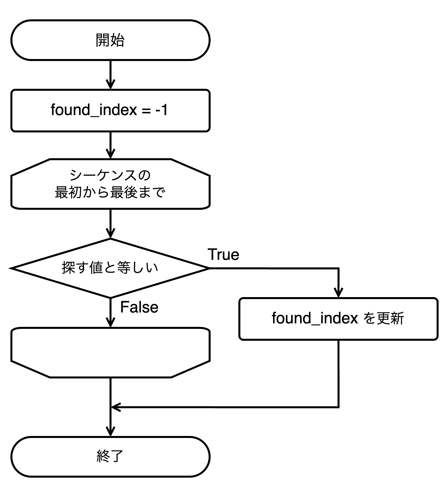

# 9. 線形探索

### 9.1 探索問題とは

探索問題とは、データの集合 (リストなど) の中から、特定の条件を満たす要素を見つけ出す問題のことです。

* 日常生活の例
  * 本棚から特定の本を探す
  * 辞書から特定の単語を探す
  * スマートフォンの連絡先から特定の人の番号を探す
* プログラミングでの重要性
  * データベースからの情報検索
  * 配列やリスト内の要素検索
  * ファイル内のテキスト検索

### 9.2 日常生活での線形探索の例

#### 例：本棚から特定の本を探す

本棚から特定の本を探す方法は、線形探索の典型的な例です。

* 本棚の左端 (または右端) から探し始める
* 一冊ずつ本のタイトルを確認していく
* 探している本が見つかったら、そこで探索を終了する
* 本棚全体を確認しても見つからなければ 「その本はない」 と判断する

この 「本探し」 の手順を自然言語で表現すると、

```
# 本探しの基本的な流れ
1. 本棚の左端から探し始める

2. まだ確認していない本があるなら:
   a. 今見ている本のタイトルを確認する
   b. もし探しているタイトルと同じなら:
      「見つかりました！」と報告して終了
   c. もし違うなら:
      次の本に移動して手順2に戻る

3. すべての本を確認しても見つからなかったら:
   「見つかりませんでした」と報告
```

### 9.3 線形探索のアルゴリズム



#### 基本的な考え方

線形探索 (リニアサーチ) は、最もシンプルで直感的な探索アルゴリズムです。

* リストの先頭から順番に各要素を調べていく
* リストの中に探している値が見つかったら、その**位置 (インデックス)** を返す
* リストの最後まで探しても見つからなかった場合は、「見つからなかった」ことを示す値 (Pythonでは慣習的に `-1` ) を返す

#### 線形探索のフローチャート

線形探索のアルゴリズムをフローチャートで表現すると、以下のようになります。

<div align="left"><figure><figcaption></figcaption></figure></div>

#### Pythonによる実装


```python
def linear_search(data_list, target):
    """
    線形探索でリスト内の要素を探す
    
    引数:
    data_list -- 探索対象のリスト
    target -- 探している値
    
    戻り値:
    見つかった場合はインデックス、見つからなかった場合は-1
    """
    # リストの各要素を先頭から順番にチェック
    for i in range(len(data_list)):
        # 現在の要素が探している値と等しいか確認
        if data_list[i] == target:
            return i  # 見つかった場合、そのインデックスを返す
    
    # リスト内を全て探しても見つからなかった場合
    return -1
```


#### 線形探索の使用例


```python
# 数値のリスト
numbers = [5, 2, 8, 4, 9, 3, 7]

# 探したい値（ターゲット）
target = 7

# 線形探索を実行
result = linear_search(numbers, target)

# 結果の表示
if result != -1:
    print(f"値{target}はインデックス{result}の位置にあります")
else:
    print(f"値{target}は見つかりませんでした")
```


### 9.4 線形探索の特徴

#### メリット

* シンプルで実装が容易
  \
  アルゴリズムの考え方が単純で、コードも短く書けます。
* 事前にデータをソート (整列) する必要がない
  \
  データがソートされている必要がありません。どんな順番のデータに対しても使えます。
* 小さなデータセットでは十分実用的
  \
  要素数が少ない場合は、処理時間も短く済みます。
* どんなデータでも適用できる汎用性
  \
  数値、文字列、その他のオブジェクトなど、様々な種類のデータに対して適用できます。
* 連続していないデータ構造でも使用可能
  \
  配列のようにインデックスで直接アクセスできないデータ構造 (例: 連結リスト) でも使えます。

#### デメリット

* 大きなデータセットでは効率が悪い:
  \
  線形探索はデータ量が多くなると、探索に時間がかかるようになります。
* 最悪の場合、すべての要素を調べる必要がある:
  \
  探している要素がリストの最後にある場合や、リスト内に存在しない場合、リストの全要素を確認する必要があります。
  \
  補足: このように、処理時間がデータ量 N に比例して増加する性質を、計算量の分野では O(N) (オーダー N) と表現することがあります。

#### 線形探索の使い所

以下の状況では、線形探索が適しているか、選択肢の一つとなります。

* データセットが小さい (要素数が少ない) 場合
* 探索を行う回数が非常に少ない場合
* データがソートされていない、またはソートするコストが高い場合
* 探しているアイテムがリストの先頭付近にある可能性が高いと予想される場合
* 連結リストのように、要素へのランダムアクセス (インデックス指定でのアクセス) が効率的でないデータ構造の場合

### 9.5 よくあるエラーと注意点

#### 比較演算子の間違い

```python
# 間違い
if data_list[i] = target:  # 代入演算子を使っている

# 正しい
if data_list[i] == target:  # 比較演算子を使うント
```

#### 探索の早期リターンを忘れる

```python
# 非効率
found_index = -1
for i in range(len(data_list)):
    if data_list[i] == target:
        found_index = i
return found_index  # リストの最後まで常に探索する

# 効率的
for i in range(len(data_list)):
    if data_list[i] == target:
        return i  # 見つかった時点で即座に返す
return -1
```

#### 重複要素への対応

* 標準的な線形探索は最初に見つかった要素のインデックスのみを返します
* 複数の一致を見つけたい場合は、見つかったすべてのインデックスを配列で返すよう実装を変更する必要があります


***

## 演習問題

線形探索のアルゴリズムの仕組みを段階的に理解しするための演習問題です。\
これらのステップは最終的に一つの関数にまとめることで、より実用的なコードになります。

#### ステップ 1: リストの各要素を順番に調べる

線形探索の基本は、リストの各要素を順番に確認していくことです。まずはその部分を実装してみましょう。

```python
# リストとターゲット値
numbers = [5, 2, 8, 4, 9, 3, 7]
target = 8

# 1. リストの各要素を順番に調べるループを作成し、各要素を表示する


```

<details>

<summary>ヒント</summary>

* `for` ループを使って、リストの各要素にアクセスします

- 例: `for item in numbers:` または `for i in range(len(numbers)):`

* まずは各要素を出力して、リスト内をどのように移動するか確認しましょう

</details>

#### ステップ 2: ターゲット値の検索

次に、ループの中で各要素がターゲット値と一致するかをチェックします。

```python
# リストとターゲット値
numbers = [5, 2, 8, 4, 9, 3, 7]
target = 8

# 2. リストの各要素とターゲット値を比較し、一致したらメッセージを表示する


```

<details>

<summary>ヒント</summary>

* ループ内で各要素とターゲット値を比較するには `if` 文を使います

- 例: `if numbers[i] == target:` または `if item == target:`

* 一致した場合は、「見つかりました！」などのメッセージを表示しましょう

</details>

#### ステップ 3: 見つかった位置 (インデックス) を記録する

ターゲット値が見つかった場合、その位置 (インデックス) を記録します。

```python
# リストとターゲット値
numbers = [5, 2, 8, 4, 9, 3, 7]
target = 8

# 初期値として「見つからなかった」ことを示す値を設定
found_index = -1

# 3. リストの各要素とターゲット値を比較し、一致したらそのインデックスを記録する


# 結果の表示
if found_index != -1:
    print(f"値{target}はインデックス{found_index}の位置にあります")
else:
    print(f"値{target}は見つかりませんでした")
```

<details>

<summary>ヒント</summary>

* インデックスを使ったループを使うと便利です: `for i in range(len(numbers)):`

- 一致した場合は、そのインデックスを `found_index` 変数に記録します

* 最初は「見つからなかった」ことを示す `-1` で初期化し、見つかった場合にのみ更新します

</details>

#### ステップ 4: 効率化 - 値が見つかったら探索を終了する

リスト内で値が見つかった場合、それ以上探索を続ける必要はありません。その時点でループを終了しましょう。

```python
# リストとターゲット値
numbers = [5, 2, 8, 4, 9, 3, 7]
target = 8

# 初期値として「見つからなかった」ことを示す値を設定
found_index = -1

# 3. リストの各要素とターゲット値を比較し、一致したらそのインデックスを記録する
# 4. breakを使って探索を終了する


# 結果の表示
if found_index != -1:
    print(f"値{target}はインデックス{found_index}の位置にあります")
else:
    print(f"値{target}は見つかりませんでした")
```

<details>

<summary>ヒント</summary>

* ループ内で値が見つかったら、`break` 文を使ってループを終了します

- これにより、不要な比較を減らして効率的に探索できます

</details>

#### ステップ5: 関数化 - 線形探索を関数にまとめる

ここまでのステップで学んだ線形探索のロジックを、再利用可能な関数にまとめましょう。

```python
def linear_search(data_list, target):
    """
    線形探索でリスト内の要素を探す
    
    引数:
    data_list -- 探索対象のリスト
    target -- 探している値
    
    戻り値:
    見つかった場合はインデックス、見つからなかった場合は-1
    """
    # 5. ステップ 1 から 4 までの処理をまとめて関数を完成させる
    # returnを使って結果を返す
    
    
# 関数をテストする
numbers = [5, 2, 8, 4, 9, 3, 7]
target_value = 8

result = linear_search(numbers, target_value)
if result != -1:
    print(f"値{target_value}はインデックス{result}の位置にあります")
else:
    print(f"値{target_value}は見つかりませんでした")
```

<details>

<summary>ヒント</summary>

* 関数内では、外部変数 (found\_indexなど) を使うのではなく、直接 `return` を使ってインデックスを返すことができます

- 値が見つかった場合はそのインデックスを返し、見つからなかった場合は `-1` を返します

* 関数化することで、異なるリストやターゲット値でも再利用できるようになります

</details>

#### 問題 9-2: 名前検索システム

名前のリストから特定の名前を探し、見つかったらその情報を表示するプログラムを作成してください。

```python
# 名前のリスト
names = ["佐藤", "鈴木", "田中", "渡辺", "伊藤", "山本", "中村", "小林"]

# 探したい名前
search_name = "田中"

# 1. 線形探索を使って名前を探す


# 2. 見つかった場合は「〇〇さんは名簿の△番目（インデックスX）にいます」と表示
#    見つからなかった場合は「〇〇さんは名簿にいません」と表示するコードを書いてください


```

<details>

<summary>ヒント</summary>

* 作成した `linear_search` 関数を使って名前を探します

- 結果に応じて適切なメッセージを表示します

* 人間が読みやすいように、「何番目」という表現では通常1から始まるため、インデックスに1を足すとよいでしょう

</details>
